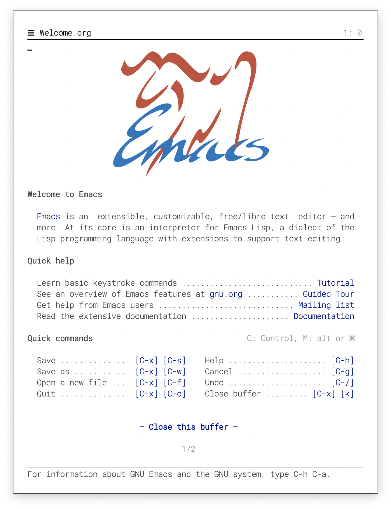
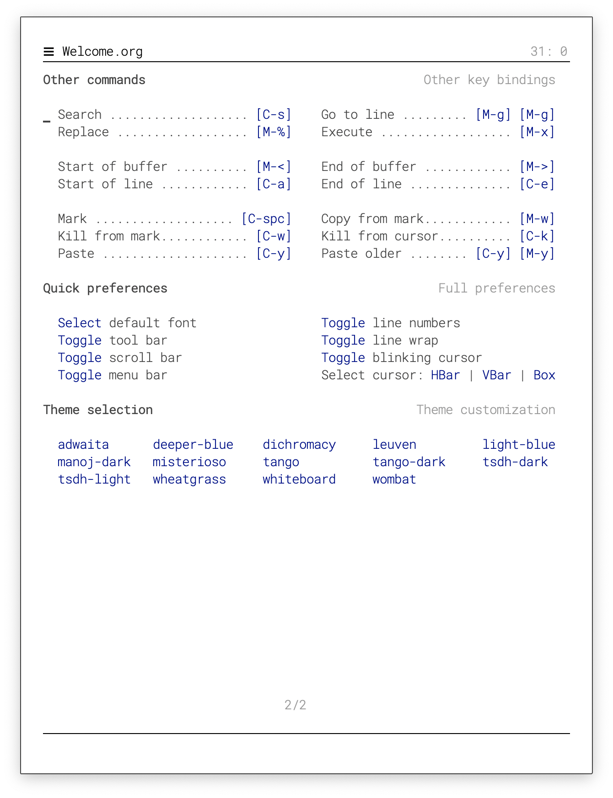

# A very minimal but elegant emacs (I think)

The goal is to have a minimal consistent vanilla emacs (i.e. no
package) and yet elegant. The defaul font is [Roboto](https://fonts.google.com/specimen/Roboto) and you'll need also the [Fira Code](https://fonts.google.com/specimen/Fira+Code) (just for the "↩" glyph).

**Usage**: `emacs -q -l elegant.el Welcome.org &`

