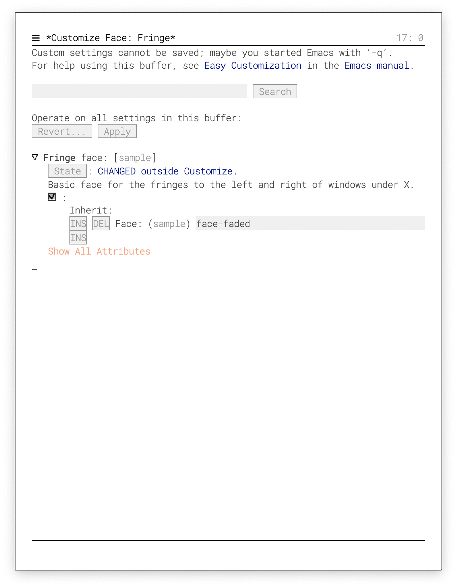

# A very minimal but elegant emacs (I think)

The goal is to have a minimal consistent vanilla emacs (i.e. no
package) and yet elegant.  
The defaul font is [Roboto Mono](https://fonts.google.com/specimen/Roboto+Mono)
and optionally, you'll need the [Fira Code](https://fonts.google.com/specimen/Fira+Code).

**Usage**: `emacs -q -l elegant.el Welcome.org &`

