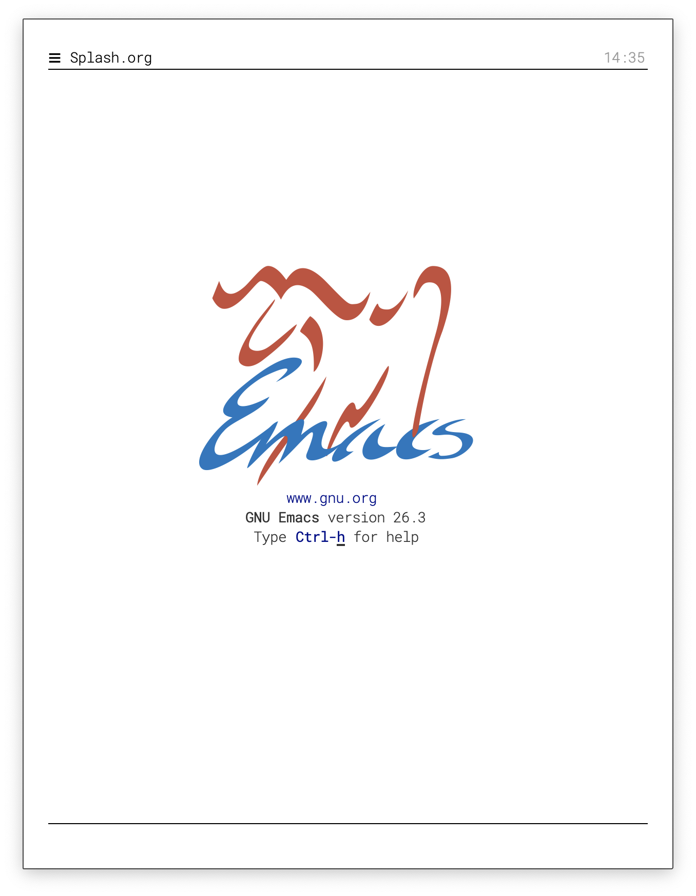
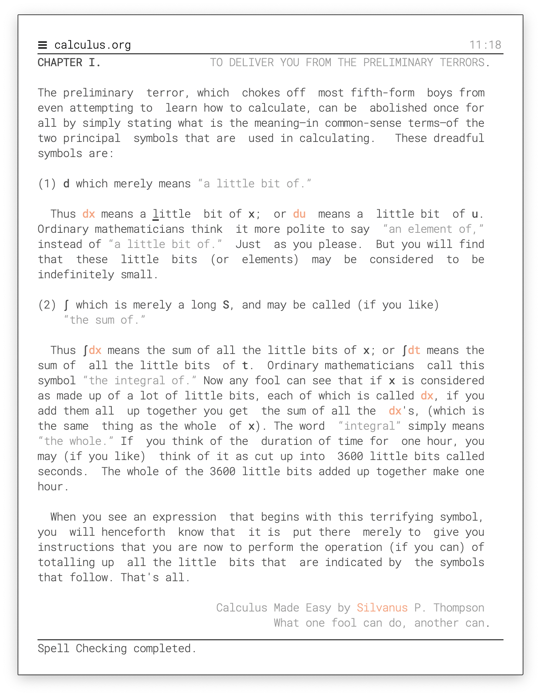
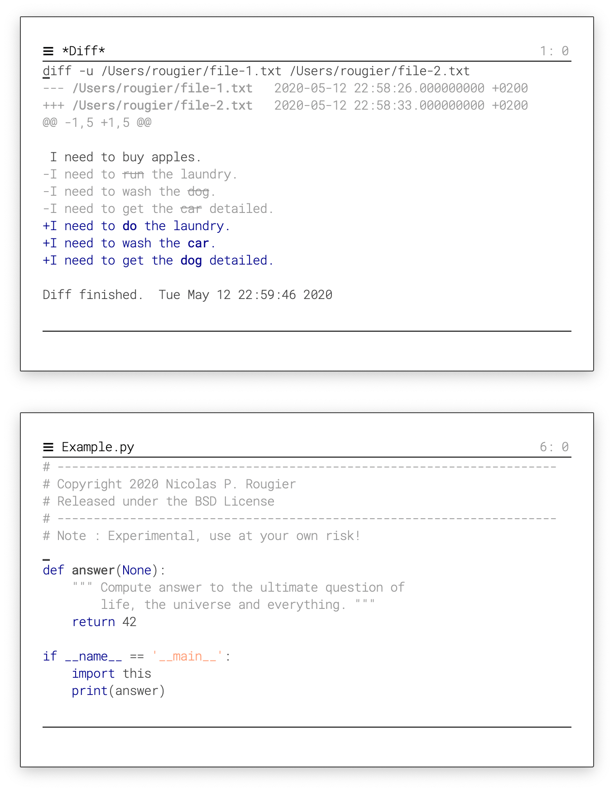
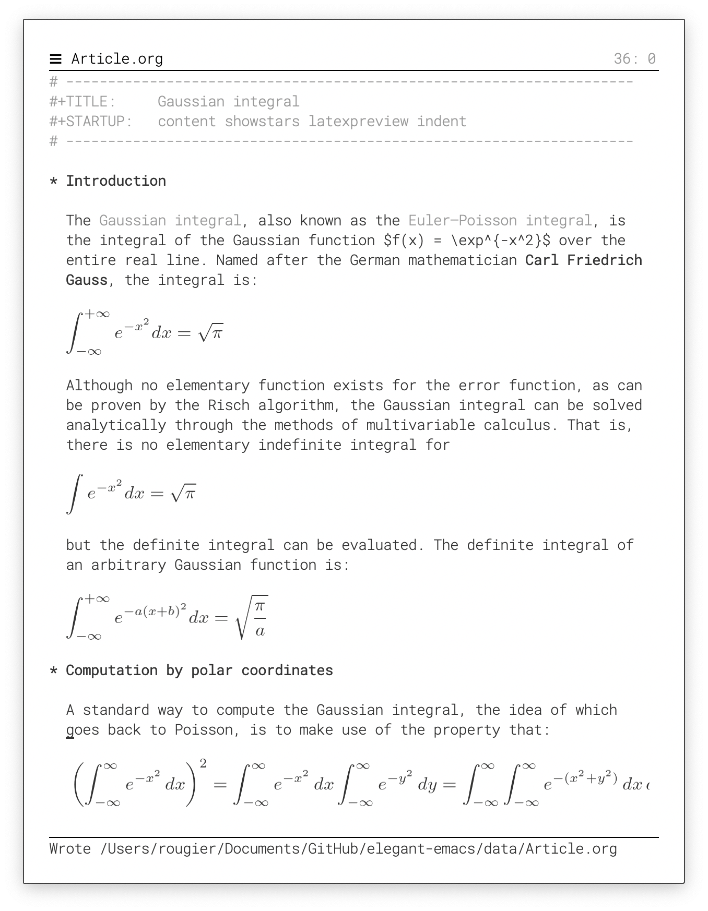
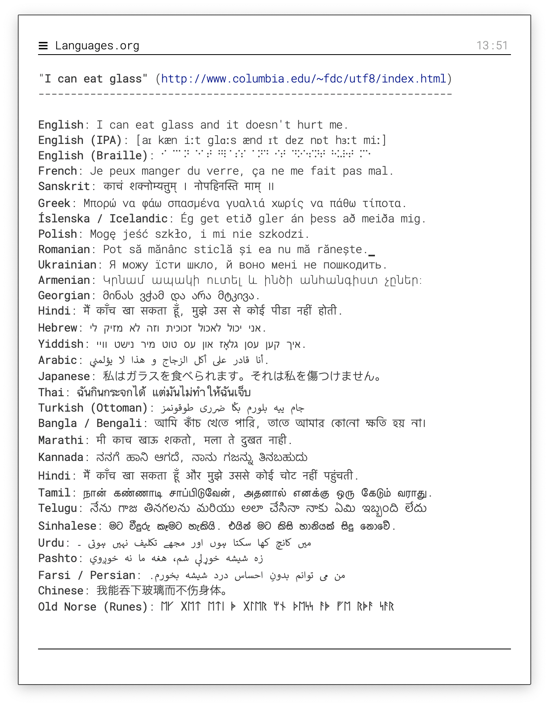
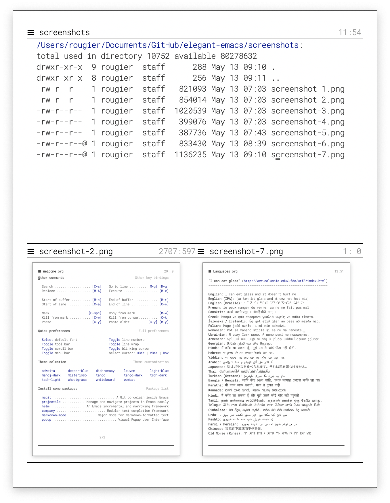

# A very minimal but elegant emacs (I think)

The goal is to have a minimal consistent vanilla emacs (i.e. no
package) and yet elegant.  
The defaul font is [Roboto Mono](https://fonts.google.com/specimen/Roboto+Mono)
and optionally, you'll also need the [Fira Code](https://fonts.google.com/specimen/Fira+Code) font.

Elegant Emacs is mostly a prototype or proof of concept. While it is
perfectly usable, you might want to have a look a [GNU Emacs / N Λ N
O](https://github.com/rougier/nano-emacs) which is more mature and
maintained.

**Usage**: `emacs -q -l sanity.el -l elegance.el Splash.org &`

